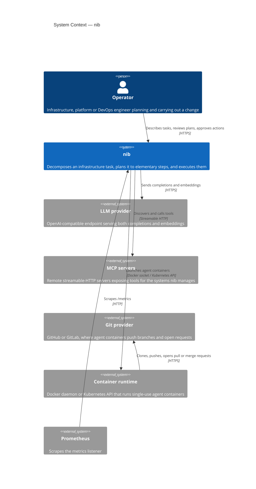
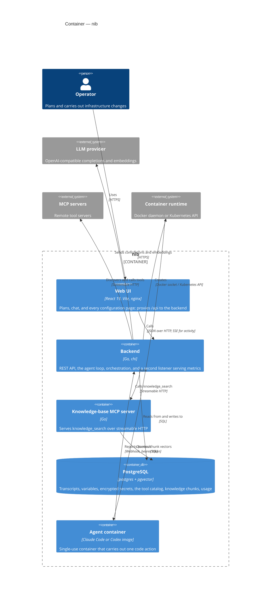

# About the architecture

Why does a tool for planning infrastructure work need four containers, a vector
database and a second HTTP listener? Because nib does three quite different
jobs — it talks to a model, it keeps an editable record of what the model
decided, and it occasionally runs something — and each of those has different
failure modes.

This page is about the shape that falls out of that, at two levels: what nib
talks to, and what it is made of. It is not about the Go package layout, which
is a contributor's concern and lives in [`CLAUDE.md`](../../CLAUDE.md).

## What nib talks to

Two things about this picture are worth dwelling on.

**There is one LLM endpoint, not two.** The same base URL serves chat
completions and embeddings. That is a real constraint rather than an
implementation detail: it is why Anthropic cannot be used directly, since it
serves no `/embeddings`, and why a provider switch can silently break knowledge
search. Separating the two endpoints would be the prerequisite for supporting
providers that serve only one — a change nobody has needed badly enough yet.

**The agent container is not nib.** It talks to the git provider itself, with
its own credentials, on its own toolchain, and reports back over a webhook. It
is the only part of the system that changes anything outside nib, and it is
deliberately the part that is easiest to turn off — the executor defaults to
disabled, and until it is configured nib plans work and hands the plan to you.

## What nib is made of

### The backend is the whole application

Everything interesting happens in one Go process: the HTTP API, the agent loop,
the orchestration of sub-agents, the MCP client, the executor, and a background
goroutine refreshing plan gauges. The web UI holds no logic that matters — it
is a React SPA behind nginx, and every route it has goes through a single HTTP
wrapper to `/api/v1`.

That concentration is a deliberate trade. It makes the system easy to reason
about and easy to run: one binary, one database, no queue, no broker. The price
is paid in the next section.

### The knowledge-base server is separate, and it is odd

`kb-mcp` is the one piece of nib that talks to nib the way a third party would:
it is an MCP server, registered by URL, exposing exactly one tool. The backend
calls it over streamable HTTP even though both are nib and both talk to the same
Postgres.

This looks like accidental complexity, and partly it is. But it means knowledge
search is not privileged: it goes through the same discovery, the same catalog,
the same per-mode inclusion rules as a tool from someone else's server. There is
no second code path for "our own tools", which is the kind of asymmetry that
rots.

It has a cost. `kb-mcp` embeds queries itself, so it carries its own copy of the
embedding settings — which is why switching providers means changing the model
name in two places, not one.

### Postgres carries more than you would guess

It holds not only transcripts and configuration but the *tool catalog*, with
pgvector embeddings of every tool description. That is what makes `tool_search`
possible, and `tool_search` is what makes it safe to narrow a mode's default
tool list: a tool taken out of a mode is still findable, so narrowing is not
losing.

The knowledge base uses the same extension for a different purpose. One database
serves both, which is why the `pgvector` image is not optional.

It also holds usage: a row per LLM call and per agent container, kept
indefinitely. Those tables carry no foreign key to the dialogs they came from,
which looks like an omission and is not — a cascade would erase the record of
what a task cost the moment someone tidied up its chat. The price is that every
join back to `chat_dialogs` has to tolerate a missing row.

### What state is *not* in Postgres

A surprising amount: `mcp.json`, skills, rules, the prompt override, the tool
allow lists, and every plan artifact — DAG, summary, action plan, report,
fan-out progress — are files on a volume.

The reason is editability. These are things an operator reads, diffs and edits
by hand, sometimes with the application running. A file is a better format for
that than a row, and a file on a mounted volume means a person can fix a broken
plan with an editor when the UI cannot.

The cost is that nib's state is split across two stores that have to be backed
up together. Restoring one against a mismatched copy of the other leaves plan
artifacts pointing at dialogs that are gone. Full inventory:
[State](../reference/state.md).

## What this architecture cannot do

**It cannot scale horizontally.** The execution lease, the SSE broker, every
lock and the plan-status refresh are all process-local, and the Helm chart pins
one backend replica. Adding a second would break all four at once — silently,
in the case of the lease. This is the price of the single-process design above,
and it is a real limit rather than a missing feature: making it multi-replica
means moving the lease into Postgres and the broker onto something shared. See
[One execution at a time](one-execution-at-a-time.md).

**It has no authentication of its own.** Every API route except the agent-runner
webhook is open to whatever can reach the port. The design assumes nib sits on a
trusted network or behind your own authenticating proxy. The metrics listener is
separate and equally open — which is why it is on its own port, unreachable
through the ingress and the frontend nginx, both of which route only `/api`.

**It has no queue.** A second execution request is refused, not queued. That is
a policy choice as much as an architectural one, and it is argued in its own
page.

## An older sketch

[`docs/archdecision.md`](../archdecision.md) is an early note listing NATS, S3
and a multi-provider LLM abstraction. None of the three exists: there is no
message queue, no object storage, and exactly one OpenAI-compatible client.
Read it as a record of what was considered, not as a description of what runs.

## See also

- [How a plan is produced](how-a-plan-is-produced.md) — what happens inside the backend during a plan
- [One execution at a time](one-execution-at-a-time.md)
- [State](../reference/state.md) — the inventory this page summarises
- [`docs/description.md`](../description.md) — the project's original scope note
